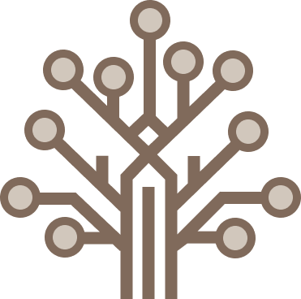

# GoalWith - for achieving goals with social support

 <!-- Add your logo path here -->

> **GoalWith** is a mobile application that helps users set and achieve goals with social support. Users can set personal goals, track progress, and share their achievements with friends.

## Key Features

### Goal Management

- Set personal goals and track progress
- Visualize progress with charts and graphs

### Social Networking

- Add peers and follow their progress
- Share goal achievements on social media
- Interact with peers through comments and reactions

### Achievement Sharing

- Share goal achievements with badges and rewards
- Timeline of achievements
- characters and level system

## Prototype Screenshots

|                                                     |                                                            |     |
| :-------------------------------------------------: | :--------------------------------------------------------: | :-: |
|  |  |
|                    _Home Screen_                    |                    _Quest Verification_                    |

|                                                     |                                                     |     |
| :-------------------------------------------------: | :-------------------------------------------------: | :-: |
|  |  |
|                    _Peer screen_                    |                    _Team screen_                    |

## Technical Stack

- **Frontend**: React Native, TypeScript
- **State Management**: Zustand
- **Navigation**: React Navigation
- **Styling**: StyleSheet
- **API Communication**: Axios
- **Data Fetching**: React Query

## Getting Started

### Prerequisites

- Node.js (v16 or higher)
- npm or Yarn
- React Native development environment
- iOS Simulator or Android Emulator

### Installation and Execution

1. Clone the repository

   ```bash
   git clone https://github.com/Sang0424/GoalWIth_FE.git
   cd GoalWith
   ```

2. Install dependencies

   ```bash
   # npm
   npm install

   # Yarn
   yarn install
   ```

3. Install iOS dependencies (iOS only)

   ```bash
   cd ios
   pod install
   cd ..
   ```

4. Run the app

   ```bash
   # iOS
   npx react-native run-ios

   # Android
   npx react-native run-android
   ```

## License

This project is licensed under the [MIT License](LICENSE).

## Contributing

Contributions are welcome! Open an issue or send a pull request.

1. Fork the repository
2. Create a feature branch (`git checkout -b feature/AmazingFeature`)
3. Commit changes (`git commit -m 'Add some AmazingFeature'`)
4. Push to the branch (`git push origin feature/AmazingFeature`)
5. Open a pull request

## Contact

For any questions or issues, please email [lyc2004y@gmail.com](mailto:lyc2004y@gmail.com)
